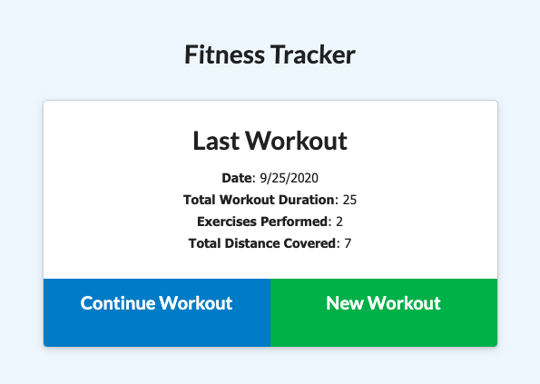
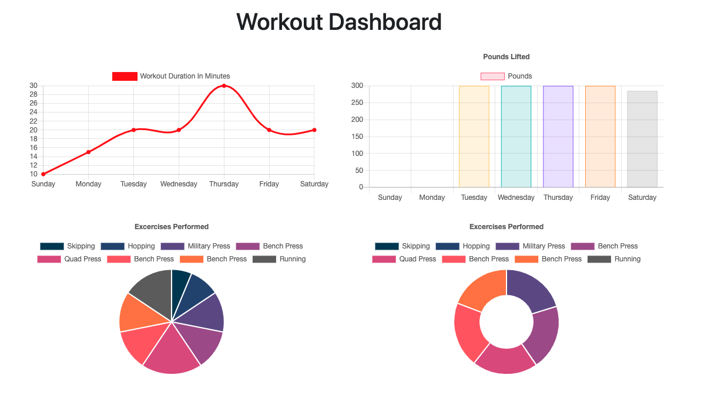

# FitnessTracker

## TABLE OF CONTENTS
* [Description](#description)
* [Usage](#usage)
* [Installation](#Installation)
* [Examples](#examples)
* [Questions](#questions)

## Description
A simple web app running on node & utilizing MongoDB w/ Mongoose that allows the user to create and track daily workouts. 

## Usage
You must first run `npm i` to install the apps dependencies, then start up the application by running `node server.js`. By default, the app will run at http://localhost:8080; this can be adjusted on line 8 of the 'server.js' file. If you would like to seed the database with some basic workouts, run `npm run seed` in the terminal - this inserts the values defined in 'seeders/seed.js'. 

Once the app is running, it will display your most recent workout on the home page (if applicable). From here you can create a new workout, or continue your current workout. In both cases, you will be prompted to enter in new exercise information - once entered, you can click "Complete" to return to the home page, or "Add Exercise" to submit the entry and add another. 

To view your last weeks worth of exercises, click "Dashboard". 

## Examples:
Live App (deployed using MongoDB Atlas on Heroku): 

Home page view:

Dashboard view:

## Questions?
Please direct all questions to cseibert2667@gmail.com, and be sure to check out my other projects at [cseibert2667](https://www.github.com/cseibert2667).
